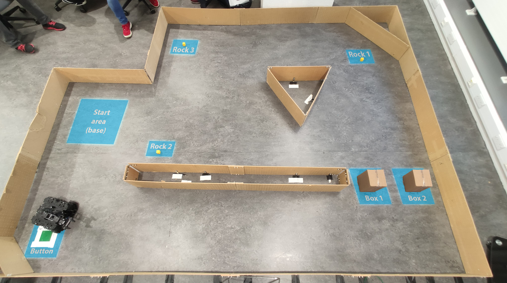
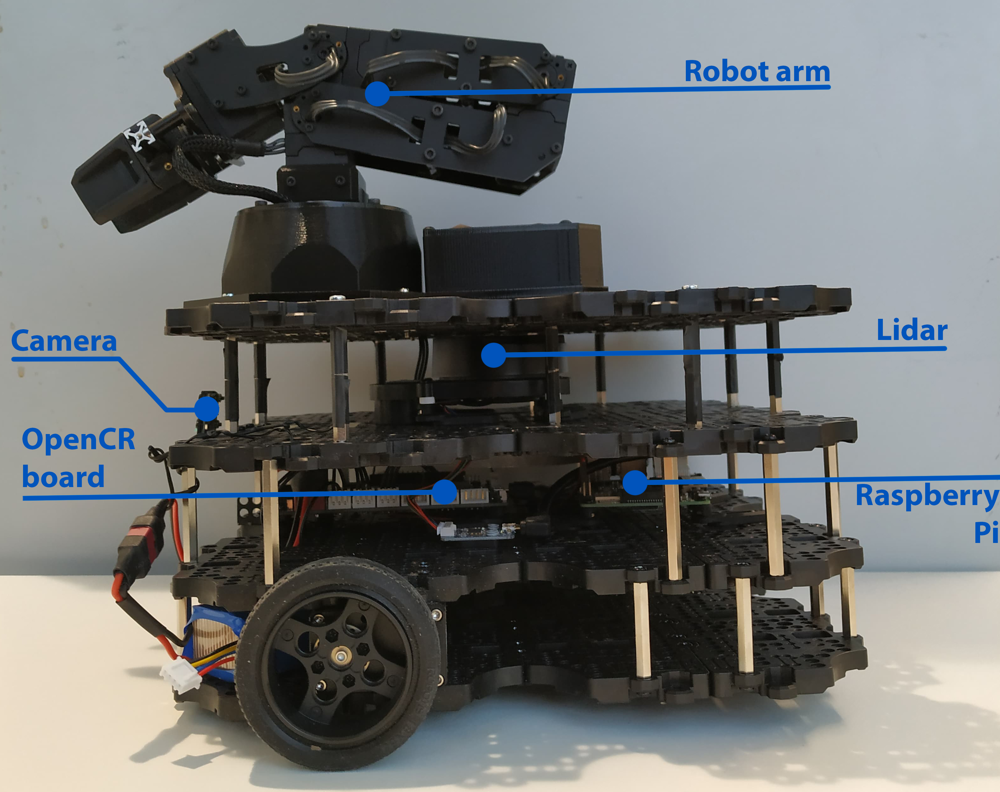
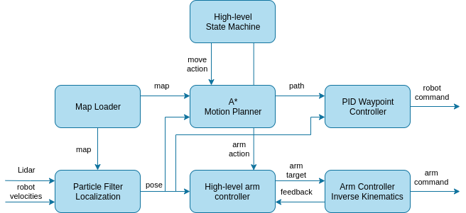
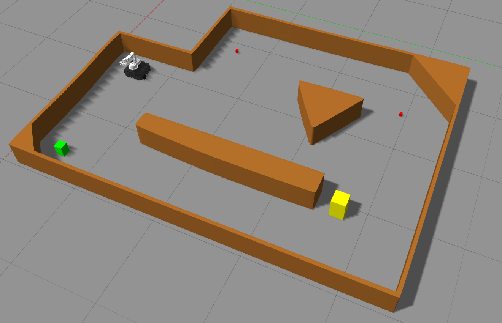

# RSS Turtlebot

This is the practical project for the Robotics: Science and Systems (R:SS) course at Edinburgh Uni.

We were tasked to use a simple wheeled mobile robot tasked with navigating autonomously around a known environment, interacting with objects and collecting rock samples with a robotic arm. More precisely, the robot is capable of:

* Navigating to the button and pressing it.
* Navigating to the boxes and clearing them away from the path. The box position is randomly chosen between two possible locations.
* Navigating to one of the predefined sample collection points and picking up a rock sample.
* Navigating back to its base in less than 5 minutes since the start.



_Note that due to the scope and short time span of the project, computer vision has not been used and instead has been accounted for by predefined positions of objects._

Authors:

* Ignat Georgiev
* Alex Roy

## Robot

The robotic platform supplied for this report was the Turtlebot3 which is a small and affordable differential drive robot. It is equipped with 2 DC Dynamixel XM430 motors which can be controlled independently and provide accurate wheel odometry. Additionally, the robot is equipped with a 9-axis IMU, Raspberry Pi Camera and an LDS-01 360\degree  Lidar. For computation, the robot uses a Raspberry Pi 3 Model B and an OpenCR board which is an embedded ARM Cortex M7 controller. Additionally, the robot is equipped with a 4 degree of freedom Interbotix PX100 robot arm which is controlled with servo motors and used for manipulation and grasping objects with the attached gripper.



## Software

The robot system has been designed to be generic and widely applicable to a variety of tasks. To run the robot, it just needs predefined:

* Discrete map of the environment read by the map loader
* Starting position
* List of action consisting of move and arm
    * Move to a 2D position in the map frame
    * Move arm end effector to a given 3D position in the map frame along with a method of moving the arm to that point.

These tasks are distributed by the **high-level state machine** as per the diagram below:



The **particle filter** uses the laser scans, 2D robot velocities and the map to localise the robot with 250 particles running at 10Hz. The sensor model uses a likelihood field to find the most probable particle and a motion model which was analytically derived from experiments with the robot.

The **motion planner** is an implementation of A* in metric coordinates which sampes possible paths around the perimeter of the robot. The cost of possible path is computed by the distance to the target and whether the robot collides with the map. Afterwards, the path is sent to the **PID Waypoint Controller** which goes through each waypoint using a PID controller for the angular velocities. The forward speed is then a function of angular speed.

Finally, there is the **high-level arm controller** which accepts 3D positions for the arm end-effector, calculates intermediary arm targets and then feeds them to the **arm controller** which uses analytical inverse kinematics to move the arm.

## Setup

Assumes Ubuntu 16.04.

1. [Install ROS Kinetic](http://wiki.ros.org/kinetic/Installation/Ubuntu)
2. Install catkin-tools - `apt install python-catkin-tools`
3. Clone repository - `git clone git@gitlab.com:imgeorgiev/rss_turtlebot.git ~/rss_turtlebot`
4. Go to repo - `cd ~/rss_turtlebot`
5. Install dependencies - `./install_deps.sh`
6. Build - `catkin build`

## Starting the robot

Select the starting position by editing the launch file `launch/milestone2.launch`. You can also modify other parameters there.

Now to start the robot:

```bash
roslaunch launch/milestone2.launch
```

## Simulation

Although the robot is robust and easy to use, real-world experiments are still time-consuming and troublesome due environment availability, battery life and hardware issues. For those reasons, we decided to create a Gazebo simulation of the task and only test the robot in the real world if it achieves the desired behaviour in simulation.



The simulation was built with the existing tools available in Gazebo and the open-source turtlebot3 plugin which simulates the robot, its sensors and interfaces. However, due to the non-traditional pairing of the robot and the Interbotix robot arm, no easy method was found of simulating the arm and instead, we opted to build it from the ground up. As the arm use servos, we chose to use PID position controllers from the ROS `position_controllers` and `controller_manager` packages to simulate the arm joints. The arm was then dynamically and visually modelled from CAD files and specifications available from the manufacturers, resulting in an accurate representation of the arm. Finally, the arm controllers in the simulation were tuned to match the transfer function of the arm in the real world. However, we could not simulate the gripper behaviour in Gazebo due to no existing functionality for it and implementing that ourselves, seemed out of the scope of the project.

Simulation can be launched with

```bash
roslaunch launch/simulation.launch use_gt:=false record:=false rviz:=false
```

_The `use_gt` flag enables ground truth odometry transform if in case you are not running a localisation node_

The robot can then be controlled via the `/cmd_vel` topic.
